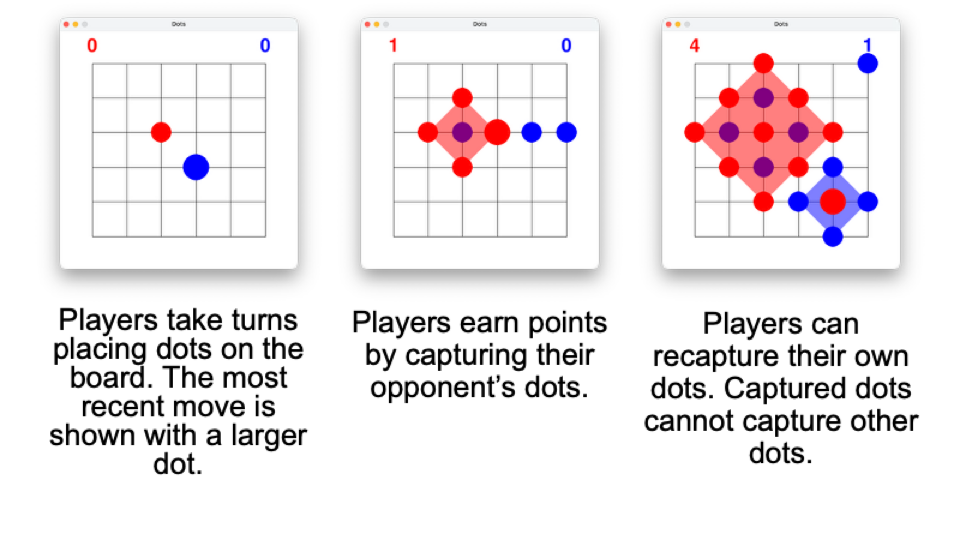

Dots aka Tochki (rus: Точки) or Kropki is a pen-and-paper game in which players seek to capture their opponents dots. This is a local version of the game made using the Pygame library.

# Game Rules


# Usage
## Run released version
- Open the [release page](https://github.com/IvanMishin1/dots-pygame/releases)
- Download Windows or macOS executable and run it.
- macOS Only: follow the instructions on [this page](https://support.apple.com/en-gb/guide/mac-help/mh40616/mac)

## Run as a python file
- Install libraries ```pip install -r requirements.txt```
- Optional: change settings by modifying main.py
- Run ```python menu.py```

## Run as an executable
- Install pyinstaller ```pip install pyinstaller```
- Run ```pyinstaller --onefile --add-data "assets:assets" menu.py```
- Run the executable

## Run in browser
- Open this [itch.io page](https://ivannn06.itch.io/dots)
- Click Run Game
- Note : due to technical limitations, the web version does not include the game menu and PvE functionality.